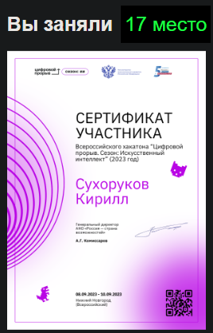

    <h2>All-Russian hackathon "Digital Breakthrough. Season: Artificial Intelligence" (2023) Case: Intelligent voice assistant for drivers</h2>

  
	
	

 
    
Computer configuration on which everything worked:

    <ul>
        <li>OC: Windows 10/11</li>
        <li>Pycharm 2022.01.01</li>
        <li>Python 3.10</li>
        <li>RAM 8 gb</li>
    </ul>
    
Instructions for use:

    <ol>
        <li>Unzip the archive with the files and from the repository to any convenient place on your computer.</li>
        <li>Open the folder with the files in a convenient environment for you (in our case Pycharm).</li>
        <li>Find the main.py file and compile it.</li>
        <li>After compilation, say the activation phrase "Hello Anya" and wait for the assistant to process your speech. If the phrase was said correctly, you will hear a notification.</li>
        <li>The next step is for you to state the fault. After processing, the assistant will voice the solution to your problem.</li>
    </ol>
    
If for some reason the activation phrase does not work, press the "ALT" button and wait for the model to skip this step. Then see step 4.

    <strong >Important Note:</strong> The Assistant does not recognize numbers greater than 9. Therefore, for example, the number 43 should be pronounced as "four three" and we accept only Russian speech.
<h2 align='center'>Result</h2>

    

<h2 align="center"> Star History</h2>

<a href="https://star-history.com/#K1rsN7/HackAI2023&Date">
 <picture>
   <source media="(prefers-color-scheme: dark)" srcset="https://api.star-history.com/svg?repos=K1rsN7/HackAI2023&type=Date&theme=dark" />
   <source media="(prefers-color-scheme: light)" srcset="https://api.star-history.com/svg?repos=K1rsN7/HackAI2023&type=Date" />
   
 </picture>
</a>

